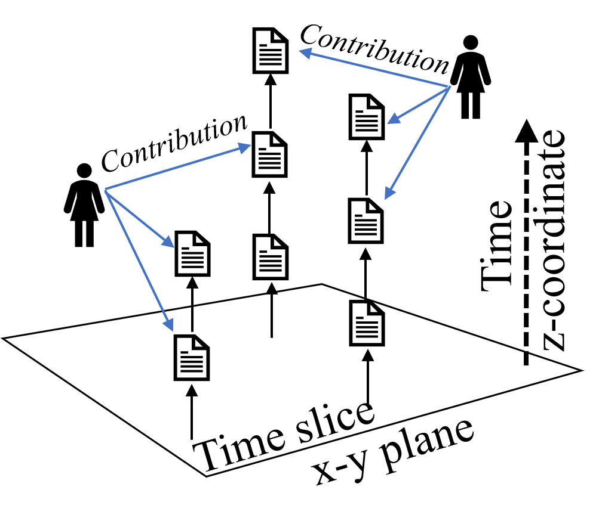

# GitVis3D
GitVis3D is a visualization tool for git communities. This tool visualizes a versioning graph 
that consists of contribution edges and update edges as 3D animation in which new nodes and edges 
are added to the scene over time. 

The basic idea of the visualizing method of the versioning graph in 3D space is shown as follows:
.

This tool also contains a funciton that automatically creates a versioning graph from commit logs 
retrieved from the GitHub repository via [GitHub API](https://developer.github.com/). 
To reduce the number of requests sent to the GitHub API, the created versioning graph is stored in 
the [Neo4j](https://neo4j.com/download/other-releases/#releases) graph database.

## Demo movie
https://www.youtube.com/watch?v=67s8WCEjIx8

## Live demo
http://qa.fujimura.com:8080/gitVis3D.html

## How to install

1. Install [Neo4j](http://neo4j.org)

2. Install JavaScript modules:
   ```bash
   git clone https://github.com/kofujimura/gitVis3D.git
   cd gitVis3D
   npm init
   npm install express --save
   npm install ejs
   npm install github-api
   npm install neo4j-driver
   npm install body-parser
   npm install socket.io
   npm install seraph
   ```

## How to use

1. Store data into Neo4j.

### start nodejs githubAPI server. 

   ```bash
   $ node githubAPIServer3000.js
   ```
### get git commit logs from github repository via http://localhost:3000/input.

   
2. Start web server

### set password to access Neo4j via http://localhost:7474 and edit cypherVis3DWebServer8080.js to set the password.

### start nodejs web server:
   ```bash
   $ node cypherVis3DWebServer8080.js
   ```
   
3. Access http://localhost:8080/gitVis3D.html

4. Run

## Licence

Copyright (c) 2017 Ko Fujimura, Released under the MIT license.
gitVis3D.html, gitVis3D.css, gitlogConvertToNeo4jData.py and cypherVis3DWebServer8080.js are MIT Licence.

Note that 3D models, ./models/Baynes and ./models/elexis (https://free3d.com/user/3dregenerator) are not part of this project. These models are examples and must be used for only personal use.

## Acknowledgment

This work was supported by JSPS KAKENHI Grant Number JP26330348.
